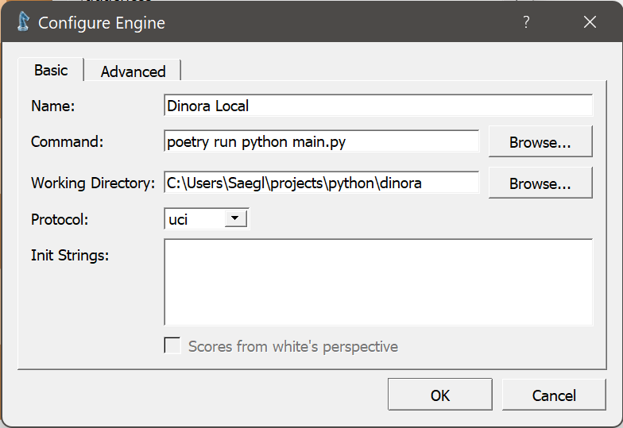

Installation
============

There is multiple ways of installing Dinora Chess engine.
You can install locally, with docker and I hope I will
make standalone executable in future by using pyinstaller
if it possible. The most stable way of installing now is 
local installation

Local installation (with pip and poetry)
----------------------------------------

Installation require some time, mostly because of
tensorflow and drivers.

1. Install nvidia drivers for tensorflow support 
(unfortunately you cannot run chess engine without 
nvidia card).
You need NVIDIA GPU Drivers, CUDA Toolkit and cuDNN.
See more in tensorflow docs https://www.tensorflow.org/install/pip

2. Clone this repo in any directory

.. code-block:: console
    
    $ git clone https://github.com/DinoraChess/dinora.git

3. Download neural network weights and put in the repo models/ directory.
https://github.com/DinoraChess/dinora/releases/tag/v0.1.0.
You need only latest.h5 file

4. Install poetry (^1.2) for python dependecies management.

.. code-block:: console

    $ pip install poetry==1.2.0rc2

or by using pipx to keep you global env clean

.. code-block:: console
    
    $ pipx install poetry==1.2.0rc2

And install python dependecies, in repo dir run

.. code-block:: console

    $ poetry install

5. Now you can check that cli interface is working.
In project directory run

.. code-block:: console
    
    $ poetry run python main.py

If you see only empty screen with no errors is good,
UCI interface is opened, now type:

.. code-block:: console
    
    uci

You should see name of the engine (Dinora), type:

.. code-block:: console
    
    go

If you see thinking process, moves and depth, hardest 
part is gone, close with `Ctrl-C`

6. Install any UCI compatible chess GUI program.
I personally recommend CuteChess https://cutechess.com/
releases - https://github.com/cutechess/cutechess/releases

7. To configure Dinora chess engine in CuteChess, 
browse Tools > Settings > Engines > Add a new engine >

| Name: Dinora Chess Engine
| Command: poetry run python main.py
| Working Directory: <folder where you cloned the repo>

In my case it looks like this

Docker installation
-------------------

[Work In Progress]

The pros of docker, you don't need install nvidia 
drivers in you host system.
Cons that I cannot make it consistently run with cutechess.
Sometimes it works, sometimes not, I don't know what is
the problem. At least cli works consistently.

If you have docker installed, all you need to do

.. code-block:: console

    $ docker compose up -d
    $ docker compose exec app uci

Other ways
----------

1. Conda: Anoter way of local installation is by using conda/miniconda.
This program may automatically install needed nvidia drivers, 
but I'm not expert of conda and don't use it regularly

2. Pyinstaller: I dream of just one standalone executable,
if you can pack it, see issue https://github.com/DinoraChess/dinora/issues/9
