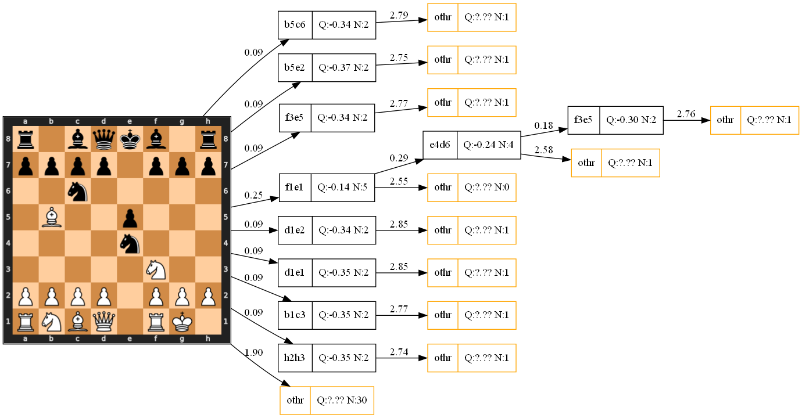

Tree visualization
==================

Do you want to visualize MCTS like this?

(Much more readable in svg, but I can't embed svg in documentation)

Installation
------------

Unfortunately poetry can't install all nedeed dependcies. You need install 
`graphviz <https://graphviz.org/download/>`_ and cairo (on windows I use `gtk3 runtime <https://github.com/tschoonj/GTK-for-Windows-Runtime-Environment-Installer/releases>`_)

then open jupyter/treeviz.ipynb,
change any available config that you want (fen, c, nodes count),
and you ready to run notebook. Generated files saved in jupyter/generated